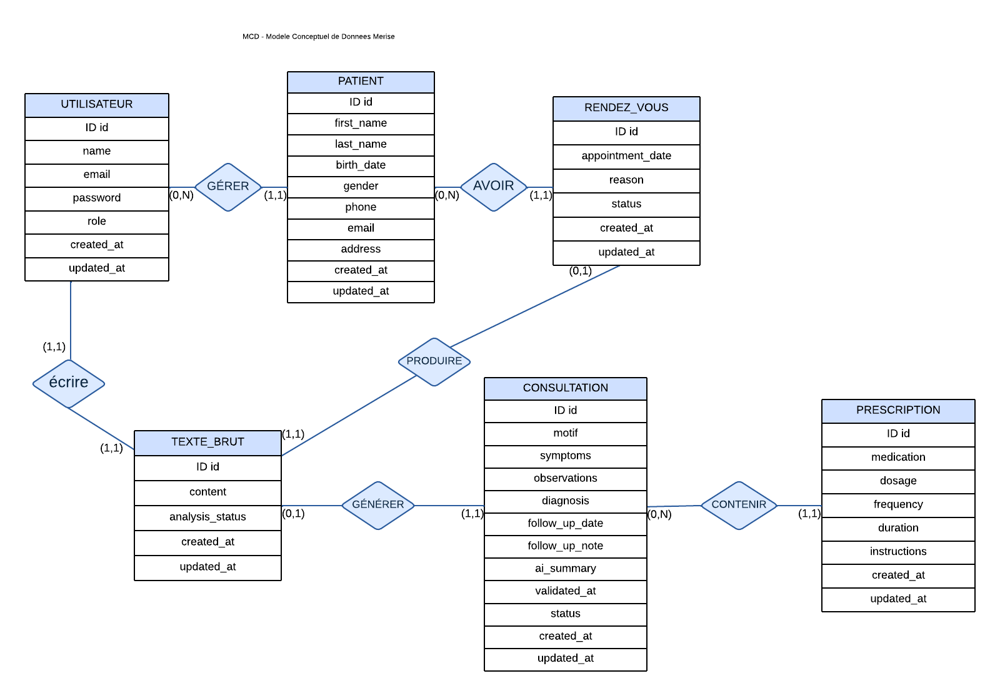
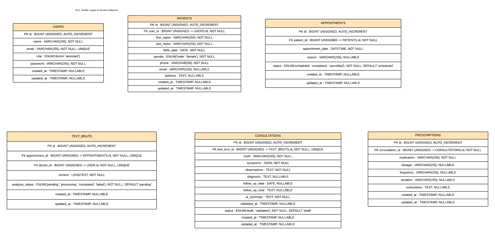

# 🩺 MediNote – Gestion de Cabinet Médical avec Intelligence Artificielle

## 📖 Description

MediNote est une application web développée avec **Laravel 13** permettant aux médecins de gérer leurs patients, rendez-vous et consultations.

Le projet intègre une **Intelligence Artificielle** basée sur **Laravel AI SDK** et **Groq** afin d'analyser automatiquement une note médicale rédigée en texte libre et de générer une consultation structurée ainsi que les prescriptions correspondantes.

Le médecin garde toujours le contrôle : aucune consultation n'est enregistrée sans validation.

---

# ✨ Fonctionnalités

## 🔐 Authentification
- Inscription
- Connexion
- Déconnexion
- Gestion des sessions avec Laravel Sanctum
- Interface d'authentification avec Laravel Breeze

---

## 👨‍⚕️ Gestion des Patients
- Ajouter un patient
- Modifier un patient
- Supprimer un patient
- Rechercher un patient
- Consulter la liste des patients

---

## 📅 Gestion des Rendez-vous
- Créer un rendez-vous
- Modifier un rendez-vous
- Supprimer un rendez-vous
- Consulter les rendez-vous

---

## 📝 Gestion des Notes Médicales
- Création d'une note médicale libre (Text Brut)
- Modification avant analyse
- Analyse par Intelligence Artificielle

---

## 🤖 Intelligence Artificielle
- Analyse automatique du texte libre
- Extraction des informations médicales
- Génération d'une consultation structurée
- Génération automatique des prescriptions
- Validation du résultat par le médecin

---

## 📋 Gestion des Consultations
- Consultation générée automatiquement
- Historique des consultations
- Affichage des prescriptions

---

# 🤖 Workflow IA

```text
Médecin

↓

Création d'une note médicale

↓

Analyse par Intelligence Artificielle

↓

Extraction des données médicales

↓

Validation par le médecin

↓

Création de la consultation

↓

Création automatique des prescriptions
```

---

# 🛠️ Technologies utilisées

### Backend
- Laravel 13
- PHP 8.3
- MySQL
- Laravel Sanctum
- Laravel AI SDK
- Laravel Queues

### Frontend
- Blade
- Laravel Breeze

### Intelligence Artificielle
- Groq API
- Structured Output

### Documentation
- Scribe
- OpenAPI
- Postman Collection

---

# 🏗️ Architecture

```text
Controller
      │
      ▼
Service Layer
      │
      ▼
AI Service
      │
      ▼
Laravel AI SDK
      │
      ▼
Groq
      │
      ▼
Structured Output
      │
      ▼
Consultation
      │
      ▼
Prescriptions
```

---

# 🗄️ Base de données

## MCD



---

## MLD



---

# 📚 Documentation API

La documentation est générée automatiquement avec **Scribe**.

Accessible après le lancement du projet :

```
http://localhost/docs
```

Elle contient :

- Authentification
- Patients
- Rendez-vous
- Text Bruts
- Analyse IA
- Consultations

---

# 🚀 Installation

## Cloner le projet

```bash
git clone https://github.com/VOTRE_USERNAME/MediNote.git
```

```bash
cd MediNote
```

Installer les dépendances

```bash
composer install
```

```bash
npm install
```

Copie du fichier d'environnement

```bash
cp .env.example .env
```

Générer la clé

```bash
php artisan key:generate
```

Configurer la base de données puis exécuter

```bash
php artisan migrate
```

Lancer le serveur

```bash
php artisan serve
```

Compiler les assets

```bash
npm run dev
```

Lancer la file d'attente

```bash
php artisan queue:work
```

---

# ⚙️ Configuration

Ajouter votre clé API Groq dans le fichier `.env`

```env
GROQ_API_KEY=your_api_key
```

---

# 📂 Documentation du projet

Le dossier **docs/** contient :

- Cahier des charges
- MCD
- MLD

---

# 📸 Captures d'écran

Les captures d'écran de l'application seront ajoutées ici :

- Authentification
- Dashboard
- Gestion des patients
- Gestion des rendez-vous
- Analyse IA
- Consultation
- Prescription

---

# 👩‍💻 Auteur

**Maroua Zouidi**

AI-Augmented Backend Developer

**Technologies :**
Laravel • PHP • MySQL • Blade • Bootstrap • REST API • Laravel AI SDK • Groq • Scribe
